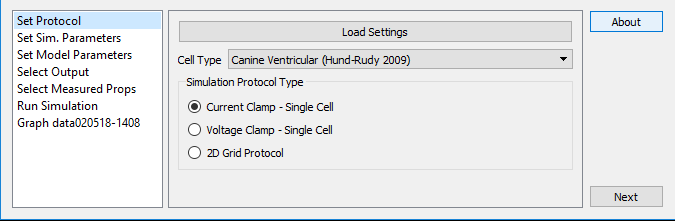
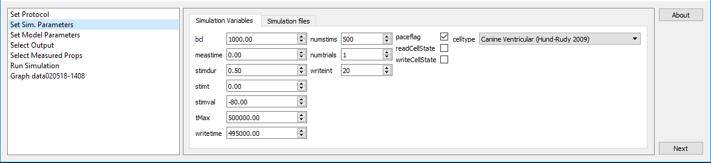
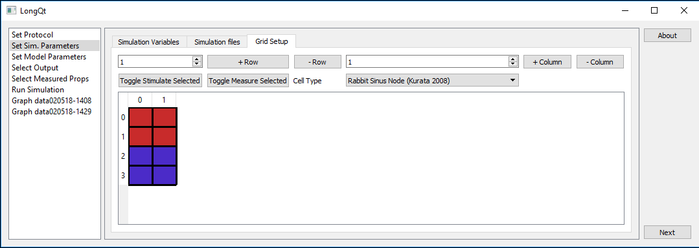
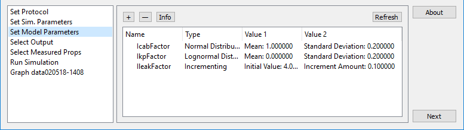
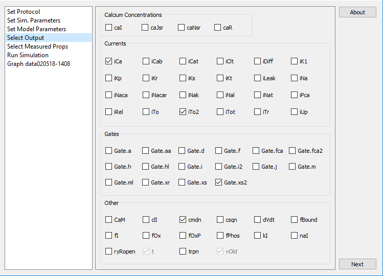
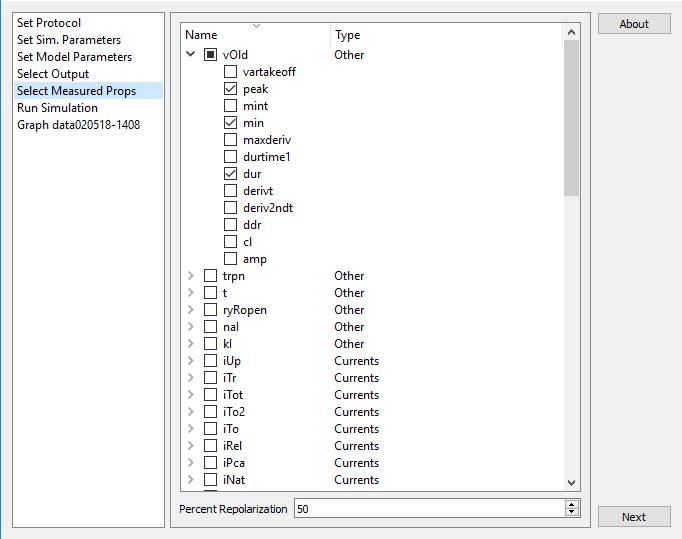
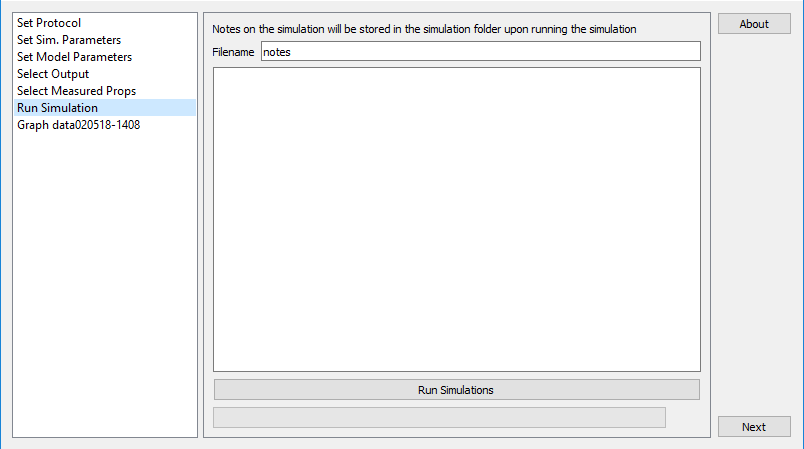
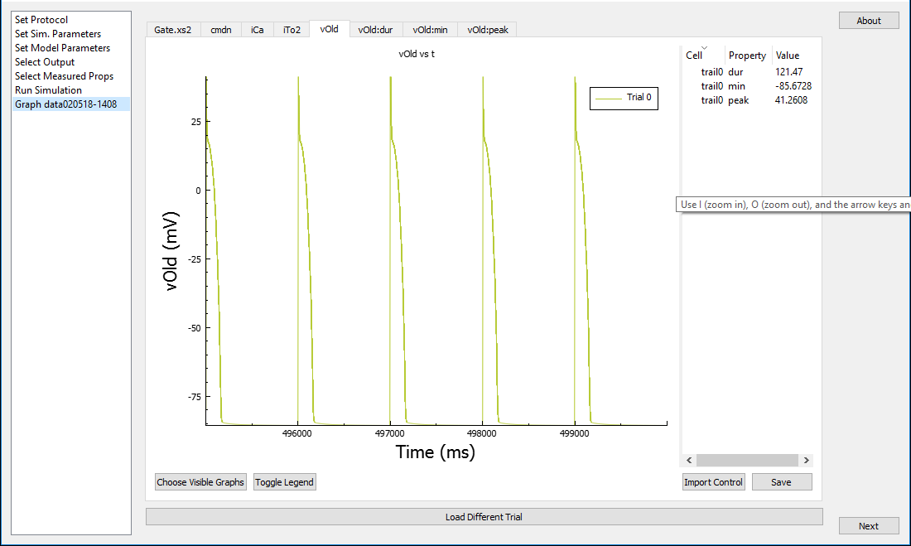

# LongQt Menus

Throughout LongQt hovering the mouse over various names will often provide more information about that name.

The first screen of LongQt is for choosing the cell type and protocol type. Cell types are the different mathematical
models LongQt has for running simulations. Models are named by the type of cell they represent so no knowledge of the
workings of the models is required to use them. All models have been validated and published in peer-reviewed journals.
Further information on their validation and the details of the models workings can be found in the papers which are
listed under the models tab.
Protocols represent the type of experiment that will be simulated. At the moment there are 3 types of protocols which
LongQt can run:

1. Current Clamp - in this simulation the cell is stimulated at regular intervals. This is similar to how the cell
would act in beating tissue.
2. Voltage Clamp - in this simulation the cell's membrane voltage is held at a specific value and the cells response
can be seen.
3. 2D Grid Protocol - the protocol for larger grids. Cells in this protocol are coupled together so they can interact.
The tissue can also be stimulated at regular intervals as in Current Clamp.

In this window there are options for customizing the protocol. For example bcl controls the amount of time in between
stimulations, while stimt sets the time at which the first stimulus happens. For further information about any of the
options hover the mouse over that option and a short description with units will display.

If grid protocol is selected then under Set Sim. Parameters there will be a tab for Grid Setup where cells can be added
and their cell types set. In order to stimulate the grid at lease one cell must be set as a stimulus cell. Similarly
in order for the Select Measured Props menu to have an effect at lease one cell must have measuring enabled. 
Conversely, the Select Output and Set Model Parameters menus always operates on all cells and requires no selection to
be made in Grid Setup.
Note: LongQt GridEditor has these options as well as further options for customizing the grid.

Set Model Parameters gives the user options to change how the ion channels function. It is not necessary to add any of
these settings. It is however useful in order to add variability to the cells. Unlike real cells, modeled cells will
always generate the same values given the same initial parameters. To fix this the user may want to add in some 
randomness. For normal healthy cells the default log-normal distribution is best.
When running multiple trials (a setting in Set Sim. Parameters) the generated values will change each trial. The values
can also be set to increase or decrease from an initial value. In that case they will increment once before each trial.

Select Output allows the user to choose which of the model's variables will be written to a file and graphed. Variables
are not written at every time step however. They are instead written out every few time steps as determined by writeint (Set Sim Parameters). Setting writeint to 0 will cause LongQt to write every value of the variable, but may cause the
simulation to run very slowly. Moving the mouse over any variable name will display information about it and its units.

LongQt will also preform some basic analysis on the simulation as it is running. This functionality is accessed through
the Select Measured Props menu. The variables are the same as the ones in Select Output, however the user need not
only select variables which are selected in the Output window. Properties (e.g. minimum, maximum) will be measured at
each time point and are recorded once per cell activation. The specific point in the cells activation that the
properties are saved is dependant on the percent repolarization number at the bottom of the screen. Percent 
Repolarization is where the cell's voltage is at relative to its maximum and minimum. For example 100% would be the
cell maximum whereas 0% would be the cell minimum. The other important aspect of the Measured Props is that while 
Selected Outputs are written only every writeint, Measured Props are measured every time step and thus are more
accurate.

Finally the page to Run the Simulation. Optionally a note about the simulation can be saved along with the data and
will be given the name specified by Filename. After writing the note run the simulation!

When simulations are finished the variables selected for that simulation will be plotted vs time in their own tabs. Bar
graphs of the measured properties are also produced. This is the same as the graphs which LongQt Grapher will produce
so there is no harm in closing longqt at this point as the results can always be plotted later.

# LongQt Files

All simulation files are stored in the datadir. datadir can be viewed or changed before running the simulaiton by
navigating to Set Sim. Parameters->Simulation files ->datadir.

* simvars.xml - All settings from the simulation are stored in this file. This is the file which
can be loaded later to rerun a simulation. It can also be edited (with care) to make changes to a simulation.
* dt0_dvars.tsv - This is the file where variables selected in Select Output are written to. This is a tab separated
value file which can be opened by excel to examine the data further. The 0 from the name is just a placeholder for the
trial number.
* dt0.tsv - Measured Properties are written to this file which is otherwise the same as dt0_dvars.tsv
* dss0_pvars.tsv - The values from Set Model Parameters are written in this file. This is a legacy file as the values
are also written to simvars.xml.
* dss0.tsv - The values from the Measured Properties at the end of the simulation.

__Note__: the file naming structure is mostly the same for grid simulations except that cell_0_1 is prepended to the output
of each file, where 0 would be the cells row number and 1 would be the cells column number.

e.      Include important notes – ex, run simulation goes from 0 to 100 when there’s only one trial
